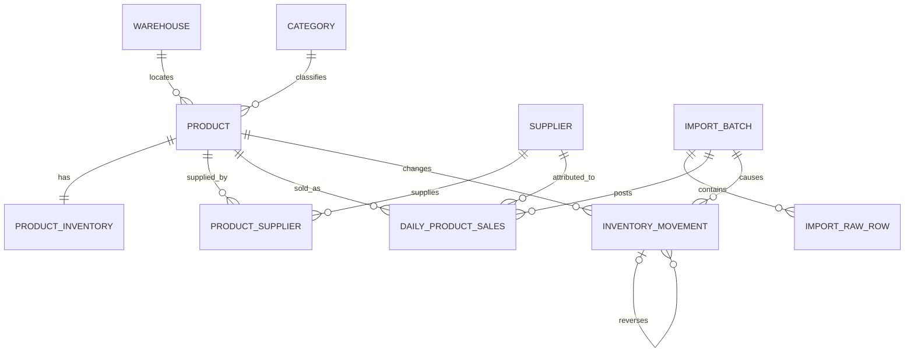

# 好物购商品销售分析系统数据库设计

> 文档状态：设计确认稿（尚未生成建表 SQL，尚未实施代码迁移）
> 更新日期：2026-08-26
> 目标数据库：MySQL 8.0（本地开发通过后迁移至阿里云 RDS MySQL）

## 1. 文档目的

本文档记录商品销售分析系统第一版数据库方案，作为后续建表 SQL、数据导入和查询功能开发的依据。

第一版只覆盖以下能力：

1. 商品查询与库存状态查询；
2. 首次导入 POS 商品库存，建立系统初始库存；
3. 上传 POS 当日销售汇总，按商品销量自动扣减库存；
4. 按最近 7 天、最近 30 天、本周、本月或自定义日期范围分析商品销售；
5. 支持负库存、退货、未知商品、重复导入保护和错误批次回退。

第一版不包含支付、采购单、订单明细、客户、库区、货架、库位和完整盘点流程。

## 2. 与当前 `main` 分支的区别

当前 `main` 已实现一条经营数据查询基础链路，现有模型以 `Store`（门店）为中心：

- 库存被表达为“门店＋日期＋商品”的库存快照；
- `StoreDailySales` 表达“门店＋营业日”的整体销售汇总；
- 已有接口按门店和日期查询库存快照或门店日销售。

本设计是结合 POS 导入文件和最新业务确认形成的目标模型：

- 仓库仅用于定位商品，不是 POS 销售数据中的维度；
- 一种商品只属于一个仓库，一个仓库可以存放多种商品；
- 当前库存按商品保存为余额，并通过库存流水追踪变化；
- 销售事实细化到“业务日期＋商品＋供应商”；
- 当日销售按商品汇总后影响库存；
- 错误批次通过反向流水撤销，不删除历史。

本文档不会直接修改或覆盖当前 `main` 的领域代码。实施前需另行决定现有门店查询链路是保留、适配还是逐步迁移。

## 3. 核心业务术语

| 术语 | 定义 |
|---|---|
| 商品 | 以条码识别的可售单元，条码是当前系统的业务唯一键 |
| 仓库 | 系统自建的商品存放位置，只定位到仓库，不继续划分库位 |
| 当前库存 | 新系统维护的商品实时库存余额，允许小于零 |
| 库存流水 | 某次初始化、销售、退货或撤销造成的库存变化记录 |
| 业务日期 | 上传销售文件时人工选择的数据归属日期，不等同于实际上传时间 |
| 导入批次 | 一次库存文件或销售文件导入的完整处理单元 |
| 有效批次 | 状态为 `POSTED`、当前参与销售分析和库存计算的批次 |
| 待完善商品 | 销售文件出现未知条码时自动创建、尚未补全仓库等资料的商品 |

## 4. 已确认的业务规则

### 4.1 商品与仓库

- 一个仓库可以存放多种商品；
- 一种商品只对应一个仓库；
- 正常商品必须分配仓库；
- 自动创建的待完善商品允许暂时没有仓库；
- 仓库不参与销售文件识别，上传销售文件时不选择仓库。

### 4.2 初始库存

- POS 库存文件只用于第一次初始化；
- 文件中的库存数量表示 POS 当前库存总数，不是本次新增数量；
- 每个商品写入一条当前库存余额；
- 同时生成 `INITIAL_BALANCE` 库存流水；
- 初始化完成后，普通导入流程不能再次覆盖全部库存。

### 4.3 每日销售

- 上传销售文件时必须选择业务日期；
- 系统另外自动记录实际上传时间；
- 只有“本期销售数量”影响库存；
- “同期销售数量”不影响库存；
- 销售文件中的 POS 库存数量只保留作核对，不覆盖新系统库存；
- 同一文件内相同商品、相同供应商的重复行先归并；
- 扣库存前，再跨供应商按商品汇总净销量，避免同一条码重复影响库存。

### 4.4 负库存和退货

- 销量大于当前库存时仍允许销售入账；
- 扣减后的库存可以小于零，并显示负库存异常；
- 正销售生成 `SALE_OUT` 流水并减少库存；
- 负销售数量按退货或冲销处理，生成 `SALE_RETURN` 流水并增加库存；
- 零销量保留原始导入记录，但不生成库存流水。

### 4.5 未知条码

- 未知条码不阻止整个销售批次入账；
- 系统按条码自动创建一条待完善商品；
- 临时商品名称、品类、供应商等优先取销售文件中的可用信息；
- 临时商品初始库存为零，仓库为空；
- 销售入账后允许临时商品形成负库存；
- 系统需要提供待完善商品列表，供后续补充仓库、单位和价格等资料。

### 4.6 批次和回退

- 每个销售业务日期最多有一个 `POSTED` 有效批次；
- 同一天可以保留多个历史批次，但旧批次必须是 `REVERSED` 或 `FAILED`；
- 相同文件重复上传时不允许再次扣库存；
- 导入过程中任何步骤失败，数据库事务自动回滚；
- 已成功入账的错误批次可以人工撤销；
- 撤销通过反向库存流水恢复库存，原销售记录和原流水不物理删除；
- 旧批次撤销后，可以重新上传同一业务日期的正确文件。

## 5. 总体数据模型

## 6. 表结构设计

当前逻辑模型包含 10 张核心表。以下字段是建表 SQL 前的逻辑字段，精确长度、默认值和部分检查约束将在 SQL 确认阶段定稿。

### 6.1 `warehouse`：仓库

一行代表一个仓库。

| 字段 | 说明 |
|---|---|
| `id` | 自增主键 |
| `warehouse_code` | 仓库编码，唯一 |
| `warehouse_name` | 仓库名称 |
| `description` | 说明 |
| `status` | 启用状态 |
| `created_at` / `updated_at` | 创建、更新时间 |

### 6.2 `category`：品类

一行代表一个商品品类。

| 字段 | 说明 |
|---|---|
| `id` | 自增主键 |
| `category_code` | POS 品类编码，可为空 |
| `category_name` | 品类名称 |
| `status` | 启用状态 |
| `created_at` / `updated_at` | 创建、更新时间 |

### 6.3 `supplier`：供应商

一行代表一个 POS 供应商标签。源数据中可能出现用斜杠连接的供应商名称，第一版按原标签整体保存，不自动拆分。

| 字段 | 说明 |
|---|---|
| `id` | 自增主键 |
| `supplier_code` | 供应商编码，可为空 |
| `supplier_name` | 供应商名称或原始标签 |
| `status` | 启用状态 |
| `created_at` / `updated_at` | 创建、更新时间 |

### 6.4 `product`：商品

一行代表一种商品。

| 字段 | 说明 |
|---|---|
| `id` | 自增主键 |
| `barcode` | 条码，业务唯一键，使用字符类型保留前导零 |
| `product_name` | 商品名称 |
| `unit` | 单位 |
| `category_id` | 品类外键，可为空 |
| `warehouse_id` | 仓库外键；待完善商品可为空 |
| `tax_cost_price` | 含税成本价 |
| `sale_price` | 当前售价 |
| `remarks` | 商品备注 |
| `data_status` | `ACTIVE`、`PENDING` 或 `DISABLED` |
| `created_at` / `updated_at` | 创建、更新时间 |

### 6.5 `product_supplier`：商品供应商关联

一行代表一个商品和一个供应商之间的关联。一个商品可以关联多个供应商。

| 字段 | 说明 |
|---|---|
| `product_id` | 商品外键 |
| `supplier_id` | 供应商外键 |
| `is_primary` | 是否主要供应商 |
| `created_at` | 创建时间 |

建议以 `product_id + supplier_id` 作为联合主键或唯一键。

### 6.6 `product_inventory`：商品当前库存

一行代表一个商品的当前库存余额，和商品是一对一关系。

| 字段 | 说明 |
|---|---|
| `product_id` | 商品主键兼外键 |
| `current_quantity` | 当前库存，使用有符号小数，允许负数 |
| `version` | 乐观锁或并发版本号 |
| `updated_at` | 最近更新时间 |

库存余额用于快速查询；所有变化必须同时写入库存流水，不能绕过业务流程直接修改。

### 6.7 `import_batch`：导入批次

一行代表一次文件导入。

| 字段 | 说明 |
|---|---|
| `id` | 自增批次主键 |
| `import_type` | `INITIAL_INVENTORY` 或 `DAILY_SALES` |
| `data_date` | 数据归属日期；销售导入时为业务日期 |
| `file_name` | 原文件名 |
| `file_hash` | 文件内容指纹，用于防重复导入 |
| `status` | `VALIDATING`、`POSTING`、`POSTED`、`REVERSED` 或 `FAILED` |
| `total_rows` / `success_rows` / `error_rows` | 行数统计 |
| `reversed_at` | 撤销时间 |
| `error_message` | 批次错误摘要 |
| `imported_at` | 实际上传和导入时间 |
| `updated_at` | 更新时间 |

数据库和应用事务共同保证同一个销售业务日期最多只有一个 `POSTED` 批次。

### 6.8 `import_raw_row`：原始导入行

一行对应 Excel 中的一行原始数据。

| 字段 | 说明 |
|---|---|
| `id` | 自增主键 |
| `batch_id` | 导入批次外键 |
| `row_number` | Excel 原始行号 |
| `barcode` | 解析出的条码，可为空 |
| `raw_data` | JSON 格式的原始字段和值 |
| `parse_status` | `PENDING`、`VALID`、`WARNING` 或 `INVALID` |
| `error_message` | 行级错误或警告 |
| `created_at` | 创建时间 |

建议对 `batch_id + row_number` 建唯一约束。

### 6.9 `daily_product_sales`：商品日销售

一行代表某有效批次、某业务日期、某商品和某供应商的销售汇总。

| 字段 | 说明 |
|---|---|
| `id` | 自增主键 |
| `batch_id` | 销售导入批次外键 |
| `business_date` | 销售业务日期 |
| `product_id` | 商品外键 |
| `supplier_id` | 供应商外键，可为空 |
| `sales_quantity` | 净销售数量，可为负数 |
| `sales_amount` | 净销售收入，可为负数 |
| `gross_profit_amount` | 毛利额；区间毛利率应由毛利额和销售额重新计算 |
| `created_at` | 创建时间 |

源文件中的销售占比、日均销售和毛利率不作为可累加核心事实。必要时可在原始导入行中保留，查询时根据基础金额重新计算。

### 6.10 `inventory_movement`：库存流水

一行代表某个批次对某个商品造成的一次库存变化。

| 字段 | 说明 |
|---|---|
| `id` | 自增流水主键 |
| `product_id` | 商品外键 |
| `batch_id` | 导入批次外键 |
| `business_date` | 业务归属日期 |
| `movement_type` | `INITIAL_BALANCE`、`SALE_OUT`、`SALE_RETURN` 或 `REVERSAL` |
| `quantity_change` | 有符号变化量；增加为正，减少为负 |
| `balance_before` | 变化前库存 |
| `balance_after` | 变化后库存 |
| `reversal_of_id` | 被撤销的原流水，可为空 |
| `created_at` | 创建时间 |

撤销批次时新增反向流水，不修改或删除原流水。

## 7. 导入处理流程

### 7.1 首次库存初始化

1. 创建 `INITIAL_INVENTORY` 导入批次；
2. 保存原始 Excel 行和文件指纹；
3. 校验条码、商品名称、库存数量和汇总/异常行；
4. 创建或更新商品、品类和供应商资料；
5. 创建每个商品的库存余额；
6. 为每个商品生成 `INITIAL_BALANCE` 流水；
7. 全部成功后将批次更新为 `POSTED`；
8. 任一步骤失败则整批事务回滚并标记 `FAILED`。

### 7.2 每日销售导入

1. 用户选择销售业务日期并上传文件；
2. 创建 `DAILY_SALES` 批次并计算文件指纹；
3. 保存原始行，过滤汇总页脚并进行字段校验；
4. 未知条码自动创建为待完善商品，初始库存为零；
5. 按商品和供应商归并后写入商品日销售；
6. 再按商品汇总净销量；
7. 锁定对应商品库存余额；
8. 正销量减少库存，负销量增加库存；
9. 写库存流水并更新当前库存；
10. 全部成功后将批次更新为 `POSTED`；
11. 任一步骤失败则整批事务回滚。

### 7.3 批次撤销

1. 锁定待撤销批次及其商品库存；
2. 检查批次当前状态为 `POSTED`；
3. 对原库存流水逐条生成反向 `REVERSAL` 流水；
4. 恢复商品当前库存；
5. 将原批次更新为 `REVERSED`；
6. 同一天允许重新上传正确文件；
7. 销售分析只统计当前 `POSTED` 批次。

## 8. 查询与索引建议

| 查询场景 | 建议索引 |
|---|---|
| 条码精确查询 | `product(barcode)` 唯一索引 |
| 商品名称查询 | `product(product_name)` 普通索引；第一版数据量较小时支持 `LIKE` |
| 按仓库、品类、资料状态筛选 | `product(warehouse_id, category_id, data_status)` |
| 按供应商查商品 | `product_supplier(supplier_id, product_id)` |
| 零库存、负库存和库存范围 | `product_inventory(current_quantity, product_id)` |
| 某日期范围商品排行 | `daily_product_sales(business_date, product_id)` |
| 单商品销售趋势 | `daily_product_sales(product_id, business_date)` |
| 批次明细查询 | `import_raw_row(batch_id, row_number)` |
| 商品库存流水 | `inventory_movement(product_id, business_date, id)` |
| 批次撤销和审计 | `inventory_movement(batch_id, id)` |

最近 7 天定义为截至所选结束日期（含结束日）的最近 7 个自然日；最近 30 天同理。界面同时提供本周、本月和自定义起止日期，避免“一个月”口径歧义。

## 9. 数据类型与兼容性原则

- 主键使用 `BIGINT UNSIGNED AUTO_INCREMENT`；
- 条码、品类编码等标识使用 `VARCHAR`，不使用整数，防止丢失前导零；
- 库存和销量使用有符号 `DECIMAL`，支持退货和负库存；
- 金额使用 `DECIMAL`，不使用浮点数；
- 业务日期使用 `DATE`；
- 审计时间使用带毫秒精度的 `DATETIME(3)`；
- 数据库、表和连接统一使用 `utf8mb4`；
- 应用层业务时区使用 `Asia/Shanghai`；
- 不依赖本地 MySQL 专有扩展，确保可迁移至阿里云 RDS MySQL 8.0。

## 10. 事务与一致性

- 导入销售事实、写库存流水、更新库存余额必须处于同一个数据库事务；
- 更新库存前锁定 `product_inventory` 对应行，防止并发导入造成丢失更新；
- 文件指纹用于阻止相同文件重复过账；
- 同一销售日期最多一个有效批次；
- 库存余额是快速查询结果，库存流水是审计依据；
- 定期可以通过全部有效流水之和核对当前库存余额；
- 任何回退通过补偿流水完成，不使用物理删除恢复业务状态。

## 11. 已知边界和待后续决定事项

1. 当前范围没有补货或采购入库。实际发生补货后，新系统库存会与 POS 逐渐产生差异；未来需要补充入库导入或库存重置流程。
2. 当前 `main` 的门店模型与本设计的仓库定位模型需要在实施前确定兼容或迁移策略。
3. POS 中用斜杠连接的供应商名称暂按整体标签保存，不自动拆成多个供应商。
4. 毛利额的精确来源仍需在 SQL 和导入实现前确认；不能简单平均源文件中的毛利率。
5. 商品名称的中文全文检索可在数据量增长后评估 MySQL `ngram` 全文索引，第一版先使用普通索引和模糊查询。

## 12. 后续步骤

1. 审阅并确认本文档中的 10 张核心表；
2. 确认字段精度、状态值、唯一约束和外键策略；
3. 处理与现有门店模型的兼容或迁移决策；
4. 生成 MySQL 8.0 建库建表 SQL；
5. 在本地 MySQL 验证后，再用于阿里云 RDS MySQL。
