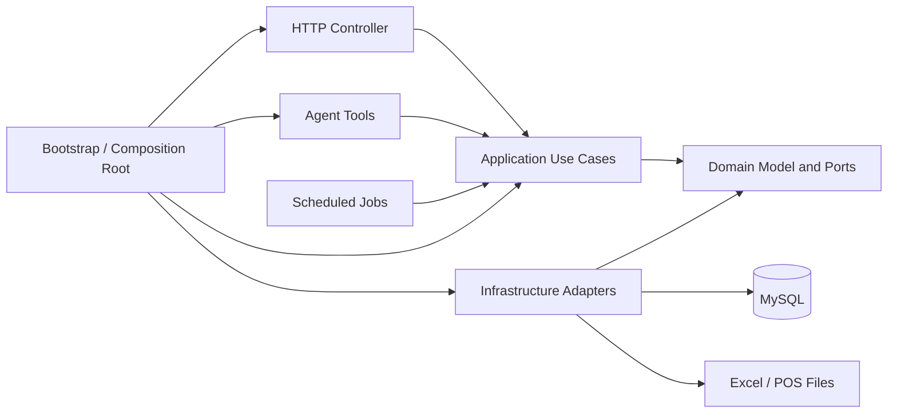

# 好物购项目整体架构规范

> 文档状态：架构基线
>
> 版本：1.0
>
> 编制日期：2026-08-27
>
> 适用项目：好物购多门店商品销售分析系统

## 1. 文档目的

本文档用于统一项目的模块边界、依赖方向、代码组织、事务规则、测试要求和功能扩展方式，目标是：

- 不同业务功能相互解耦；
- 代码职责清晰、易于阅读和测试；
- 新增功能优先通过新增纵向功能切片实现；
- 降低修改已有功能时产生连锁影响的概率；
- 保持本地 MySQL 与后续阿里云 RDS MySQL 部署方式一致；
- 为后续员工任务管理和 Agent 能力保留稳定扩展位置。

本文使用以下约束词：

- **必须**：所有新增代码均应遵守；
- **应该**：默认遵守，偏离时需要在 Pull Request 中说明理由；
- **可以**：按实际场景选择，不要求提前实现。

## 2. 总体架构结论

项目采用：

```text
模块化单体
+ 纵向功能切片
+ Ports & Adapters（六边形架构）
+ 轻量 CQRS
```

当前阶段不采用微服务、事件溯源、分布式事务或独立消息中间件。

### 2.1 架构关系



核心原则：HTTP、Agent、定时任务只是不同入口，所有入口必须复用 application 中的相同业务用例。

## 3. 已确认业务边界

### 3.1 当前核心业务域

| 业务域 | 职责 | 不负责 |
|---|---|---|
| 门店与仓库 | 门店资料、门店下仓库和货物定位 | 库位、货架、跨店调拨 |
| 商品目录 | 全局商品、品类、供应商和商品资料状态 | 门店库存余额 |
| 门店库存 | 门店商品当前库存、库存状态和库存流水 | 商品名称等主数据 |
| 销售导入 | POS 日销售文件、销售事实、库存扣减和批次审计 | 支付、订单明细 |
| 经营分析 | 按门店、商品和日期聚合销售与库存指标 | 修改库存或销售事实 |
| 导入批次 | 幂等、状态、错误记录、撤销和重传 | 解析之外的页面逻辑 |
| Agent | 将自然语言或工具调用转换为 application 用例调用 | 直接访问数据库 |

### 3.2 预留业务域

员工任务管理作为独立业务域预留，暂定包含：

- 员工资料；
- 任务布置；
- 任务进度查看。

以下颗粒度尚未确认，当前架构规范不得据此创建数据库表或业务代码：

- 员工属于一个门店还是可以跨门店；
- 一个任务分配给一人还是多人；
- 进度采用状态、百分比、步骤还是组合方式；
- 员工是否登录系统并自行更新进度；
- 员工、系统账号、角色和门店权限的关系。

### 3.3 当前明确不属于系统范围

- 支付；
- 收银交易处理；
- 采购订单；
- 客户管理；
- 薪资、考勤等人力资源功能；
- 复杂仓库库位管理。

## 4. Maven 模块规范

保留当前六个 Maven 模块，不因为新增一个普通业务功能就新增 Maven 模块。

```text
haowugou-common
haowugou-domain
haowugou-application
haowugou-infrastructure
haowugou-agent
haowugou-bootstrap
```

### 4.1 模块职责

| Maven 模块 | 允许内容 | 禁止内容 |
|---|---|---|
| `haowugou-common` | 极少量跨模块基础类型 | 业务实体、Mapper、万能工具类 |
| `haowugou-domain` | 领域对象、值对象、业务规则、Repository 接口 | Spring MVC、MyBatis、数据库 DataObject |
| `haowugou-application` | 用例编排、输入校验、事务流程、应用异常 | SQL、HTTP DTO、直接使用 Mapper |
| `haowugou-infrastructure` | MyBatis、Excel、POS 文件和外部系统 Adapter | Controller、HTTP 状态码、跨用例编排 |
| `haowugou-agent` | Agent Tool、提示编排和 application 调用适配 | 直接访问 Mapper 或数据库 |
| `haowugou-bootstrap` | Spring Boot 启动、Controller、配置、Bean 组装和异常映射 | 业务 SQL、核心业务规则 |

### 4.2 允许的依赖方向

```text
common
  ↑
domain
  ↑
application

infrastructure → domain
agent → application → domain
bootstrap → application + infrastructure + agent
```

必须遵守：

- `domain` 不得依赖 `application`、`infrastructure`、`bootstrap` 或 `agent`；
- `application` 不得依赖 `infrastructure`、`bootstrap` 或 `agent`；
- `infrastructure` 不得依赖 `bootstrap`；
- `agent` 只能调用 application 用例；
- Controller 不得直接调用 Mapper；
- Mapper 和 DataObject 不得出现在 domain 或 application 的公开接口中。

## 5. 纵向功能切片规范

每个技术层内部必须继续按业务能力分包，避免形成巨型 `service`、`mapper` 或 `controller` 包。

推荐结构：

```text
haowugou-domain
└─ com.haowugou.domain
   ├─ store
   ├─ catalog
   ├─ inventory
   ├─ sales
   ├─ importbatch
   └─ worktask          # 仅在员工任务颗粒度确认后创建

haowugou-application
└─ com.haowugou.application
   ├─ storeproductquery
   ├─ inventoryimport
   ├─ dailysalesimport
   ├─ batchreversal
   ├─ salesanalysis
   └─ worktask          # 暂不创建实现

haowugou-infrastructure
└─ com.haowugou.infrastructure
   ├─ persistence
   │  ├─ storeproductquery
   │  ├─ inventory
   │  ├─ sales
   │  └─ importbatch
   └─ fileimport

haowugou-bootstrap
└─ com.haowugou.controller
   ├─ store
   ├─ product
   ├─ warehouse
   ├─ importbatch
   ├─ analysis
   └─ worktask          # 暂不创建实现
```

一个功能切片应覆盖其必要的 Controller、用例、领域规则、端口、Adapter 和测试，但不得顺便重构无关功能。

## 6. 深模块与接口规范

模块应提供小而稳定的接口，并在实现内部隐藏复杂度。

### 6.1 必须遵守

- 调用方只需要知道输入、输出、业务约束和错误模式；
- 不得为了“看起来解耦”给每个实现类创建一一对应的接口；
- 只有存在技术替换、测试替身或外部系统差异的 seam 才建立端口；
- 参数超过合理数量时，使用语义明确的 Command 或 Criteria 对象；
- 不得使用无业务含义的 `Map<String, Object>` 传递核心数据；
- 不得创建通用 `BaseController`、`BaseService`、`BaseRepository` 承载业务行为。

### 6.2 命名规范

| 类型 | 命名示例 |
|---|---|
| 查询用例 | `StoreProductQuery`、`SalesAnalysisQuery` |
| 写入用例 | `PostDailySalesImport`、`ReverseImportBatch` |
| 查询条件 | `StoreProductQueryCriteria` |
| 领域仓库接口 | `StoreRepository`、`InventoryRepository` |
| 基础设施 Adapter | `MybatisStoreRepository` |
| 数据库对象 | `StoreDataObject`、`StoreProductInventoryRow` |
| HTTP 请求/响应 | `ProductSearchRequest`、`ProductDetailResponse` |

避免使用含义模糊的 `Manager`、`Helper`、`Utils`、`Processor` 或大范围 `OperatingDataService`。

## 7. 设计模式采用规则

### 7.1 默认采用

| 模式 | 使用位置 |
|---|---|
| Ports & Adapters | Repository、文件解析、Agent、外部系统 |
| Repository | 隔离领域/应用与 MyBatis |
| Application Use Case | 查询、导入、撤销等完整业务动作 |
| Criteria | 多条件商品与分析查询 |
| 组合根 | 在 bootstrap 统一组装 Bean 与 Adapter |

### 7.2 按场景采用

| 模式 | 采用条件 |
|---|---|
| Strategy | 已存在两种以上可替换规则，例如不同导入类型 |
| Pipeline | Excel 导入包含解析、校验、归并、过账等稳定阶段 |
| 轻量状态机 | 导入批次或任务存在受控状态流转 |
| Factory | 创建对象时需要集中维护多个业务不变量 |
| Domain Event | 事务提交后的通知、提醒或分析刷新 |
| Adapter/ACL | POS 字段或外部模型与内部领域含义不同 |

### 7.3 当前禁止引入

- 微服务拆分；
- Event Sourcing；
- 为所有操作引入 Command Bus 或 Query Bus；
- 为单一实现提前设计插件框架；
- 使用异步事件完成必须强一致的库存扣减；
- 为尚未确认的员工任务颗粒度提前建表或编码。

## 8. 轻量 CQRS 规范

查询和写入在代码职责上分离，但共享同一个 MySQL 数据库，不引入独立总线。

### 8.1 查询侧

- 查询用例只读，不修改业务数据；
- 可以使用专用查询视图和行模型；
- 返回适合页面的结果，不要求加载完整领域对象；
- 商品查询必须携带 `storeId`；
- 分页、排序和日期范围必须稳定且可验证；
- 禁止先查询所有门店数据再在 Java 内存中过滤。

### 8.2 写入侧

- 写入用例负责业务校验、状态变化和事务边界；
- 必须通过领域规则修改库存和批次；
- 写入后结果应明确表示成功、失败或业务冲突；
- 不得由 Controller 拼接多个 Repository 调用模拟事务。

## 9. 多门店隔离规范

门店是库存和销售数据的强制隔离维度。

必须满足：

- 商品主数据可以跨门店共享；
- 库存、仓库位置、销售、导入批次和库存流水必须包含门店范围；
- 查询同一商品时必须同时限定 `store_id`；
- 仓库查询必须限定所属门店；
- `warehouseId` 与 `storeId` 不匹配时必须拒绝；
- 同一商品在两个门店的库存和销售不得相互影响；
- 后续权限模块只能缩小用户可访问门店范围，不能替代底层查询的 `storeId` 条件。

多门店功能的集成测试必须至少使用两个门店和一个两店共有商品。

## 10. HTTP 接口规范

### 10.1 路径

门店范围资源优先使用嵌套路径：

```http
GET /api/stores/{storeId}/products
GET /api/stores/{storeId}/products/{productId}
GET /api/stores/{storeId}/warehouses
```

不得在同一项目中同时保留“嵌套路径”和“必填门店查询参数”两套等价接口。

### 10.2 Controller

- 只负责参数绑定、DTO 转换和调用 application；
- 不包含 SQL、事务和库存规则；
- 不直接返回 DataObject；
- 统一通过异常处理器映射 HTTP 状态码；
- 日期采用 ISO `yyyy-MM-dd`；
- 金额和数量使用 `BigDecimal`，禁止使用 `double`；
- 分页必须设置最大 `size` 并使用稳定排序。

### 10.3 错误响应

应该统一使用 Spring Problem Detail，至少包含：

- HTTP 状态；
- 稳定错误编码；
- 可读错误说明；
- 请求路径；
- 必要时包含字段错误列表。

内部异常堆栈、SQL 和数据库连接信息不得返回给客户端。

## 11. 数据持久化规范

- MySQL 8.0 为数据库基线；
- 表、字段和索引使用 `snake_case`；
- Java 使用 `camelCase`；
- 条码和业务编码使用字符串，不使用整数；
- 金额、数量使用 `DECIMAL`/`BigDecimal`；
- 业务日期使用 `DATE`/`LocalDate`；
- 审计时间使用毫秒精度时间戳；
- 业务历史记录原则上不物理删除；
- 外键、唯一约束和检查约束用于保护稳定不变量；
- Repository 接口不得暴露 MyBatis Wrapper、Page 或 DataObject；
- SQL 查询必须明确列名，不使用 `SELECT *`；
- 列表查询必须检查 N+1、重复分页和索引命中。

当前开发期由开发者手动执行 SQL。进入共享测试环境或阿里云数据库前，应该引入 Flyway 等版本化迁移工具；迁移不得在未评审时自动修改生产数据。

## 12. 事务与并发规范

一个写入用例对应一个明确事务边界。

销售导入正式过账时，下列操作必须处于同一事务：

1. 确认批次可过账；
2. 写入商品日销售；
3. 写入库存流水；
4. 更新门店商品库存；
5. 更新批次状态。

还必须满足：

- 文件解析和大部分格式校验应在正式过账事务之前完成；
- 同一批次只能过账一次；
- 使用数据库唯一约束与应用校验共同保证幂等；
- 当前库存更新必须使用行锁、乐观版本号或等价原子更新；
- 负库存允许存在，不能因库存不足丢弃真实销售；
- 撤销通过反向流水完成，不删除原销售和原流水；
- 核心一致性不得依赖异步消息、定时补偿或数据库触发器。

## 13. 导入模块规范

导入模块应该将 POS 外部字段与内部模型隔离：

```text
文件读取 → 原始行保存 → 字段解析 → 业务校验 → 商品归并 → 正式过账
```

推荐接口：

```text
ImportFileParser
ImportValidator
ImportHandler
```

只有在出现第二种实现时才提取更多策略接口。

批次状态必须由统一规则控制，例如：

```text
VALIDATING → POSTING → POSTED
     │           │
     └───────────┴→ FAILED
POSTED → REVERSED
```

任何入口都不得绕过状态规则直接更新批次状态。

## 14. 员工任务管理预留规范

员工任务管理与销售、库存保持独立。未来确认颗粒度后，可在现有各层新增 `employee` 和 `worktask` 功能切片，不需要拆分微服务。

预留依赖规则：

- 销售和库存模块不得依赖员工任务模块；
- 员工任务模块可以引用稳定的门店标识，但不得直接修改门店、商品或库存；
- 如果以后需要“负库存产生处理任务”，应由 application 编排或事务后事件连接两个模块；
- 员工实体不得直接等同于登录账号；
- 身份认证和门店权限应作为独立能力设计；
- 在业务颗粒度确认前，不定义任务表、状态枚举或进度百分比规则。

## 15. Agent 模块规范

`haowugou-agent` 是入口 Adapter，不是业务规则层。

必须满足：

- Agent Tool 只调用 application 用例；
- Agent 不直接调用 Mapper、Repository Adapter 或 JDBC；
- Agent 输入必须经过与 HTTP 相同的应用校验；
- Agent 不得绕过门店范围和未来的权限检查；
- Agent 输出使用稳定应用结果，不暴露数据库对象；
- 模型生成内容不得直接作为库存或销售写入，必须经过确定性校验和用户授权流程。

## 16. `common` 模块规范

`haowugou-common` 必须保持小型。

可以放入：

- 稳定且真正跨模块使用的基础类型；
- 与业务无关的少量通用错误结构。

不得放入：

- 商品、库存、销售、员工等业务对象；
- 通用 Repository；
- `BeanUtils`、`DateUtils` 等无边界工具集合；
- 仅被一个模块使用的类；
- 为避免循环依赖而临时移动的业务代码。

## 17. 测试规范

### 17.1 测试层次

| 测试 | 重点 |
|---|---|
| Domain 单元测试 | 状态、数量、日期和业务不变量 |
| Application 单元测试 | 用例编排、校验、异常和事务结果 |
| Infrastructure 集成测试 | SQL、映射、索引条件和多门店隔离 |
| Controller 契约测试 | 参数、JSON、HTTP 状态和 Problem Detail |
| 架构测试 | Maven/包依赖方向和禁止越层调用 |

### 17.2 强制场景

- 门店 A 查询不到门店 B 的库存、仓库和销售；
- 同一商品在不同门店有独立库存；
- 供应商多对多不会造成重复分页；
- 已撤销批次不进入有效销售分析；
- 销售超过库存后正确形成负库存；
- 未知条码可以入账并形成待完善商品；
- 失败导入不产生部分销售或部分库存变化；
- 撤销批次恢复库存且保留审计历史。

建议引入 ArchUnit 或等价测试，自动检查 Controller 不调用 Mapper、domain 不依赖 Spring/MyBatis 等规则。

## 18. 日志与审计规范

- 日志记录业务批次 ID、门店 ID、业务日期和结果；
- 不记录数据库密码、令牌、完整上传文件内容或其他敏感信息；
- 导入错误必须能定位文件、批次和原始行；
- 库存变化必须能够从流水追溯来源；
- 业务撤销必须记录操作人、时间和原因；
- 日志用于技术排错，数据库审计记录用于业务追溯，两者不能互相替代。

## 19. Git 与交付规范

### 19.1 分支

每个纵向功能切片使用独立分支，例如：

```text
codex/store-product-query
codex/initial-inventory-import
codex/daily-sales-import
codex/import-batch-reversal
codex/sales-analysis
codex/work-task-management
```

员工任务分支只能在需求颗粒度确认后创建。

### 19.2 Pull Request

一个 Pull Request 应尽量只包含一个可独立验收的功能切片，并写明：

- 业务目标；
- 接口变化；
- 数据库变化；
- 事务和并发影响；
- 测试范围；
- 不在本次实现的内容；
- 回滚方式。

禁止把数据库设计、无关重构、格式化和多个业务功能混在同一 Pull Request。

## 20. 何时新增 Maven 模块

新增普通业务功能时，默认只新增功能包，不新增 Maven 模块。

只有同时满足多个条件时才考虑新增 Maven 模块：

- 依赖与现有模块明显不同；
- 需要独立禁止其他模块访问内部实现；
- 可以独立测试和替换；
- 模块接口稳定且实现复杂度足够高；
- 新模块不会形成循环依赖。

例如 `haowugou-agent` 因 AI 依赖和入口性质不同，独立 Maven 模块是合理的；普通员工任务功能目前不需要独立 Maven 模块。

## 21. 开发顺序基线

当前建议顺序：

1. 完成多门店商品查询纵向切片；
2. 完成按门店导入初始库存；
3. 完成按门店导入每日销售和库存扣减；
4. 完成导入批次查询、撤销和同日重传；
5. 完成最近 7 天、30 天和自定义区间经营分析；
6. 对齐员工任务管理业务颗粒度；
7. 设计员工任务数据库与纵向切片；
8. 增加用户、角色和门店权限；
9. 接入前端和 Agent Tool。

顺序可以按业务优先级调整，但不得跳过模块接口、事务和测试设计。

## 22. 功能完成定义

每个功能只有满足以下条件才算完成：

- 业务颗粒度和非目标已确认；
- 使用独立功能分支；
- Controller、application、domain 和 infrastructure 职责没有越层；
- 多门店数据范围正确；
- 事务、幂等和错误模式明确；
- 没有引入无实际替换需求的抽象；
- 单元测试、集成测试和契约测试通过；
- 完整 `mvn test` 通过；
- 数据库变更有独立 SQL 或版本化迁移；
- 文档与实现保持一致；
- Pull Request 可以独立审阅和回滚。

## 23. 当前待决事项

以下事项必须在对应功能开发前逐项确认：

1. 商品唯一业务键是否始终使用条码；
2. POS 后续补货如何进入系统库存；
3. 登录账号、角色和门店权限模型；
4. 员工与门店的关系；
5. 任务单人或多人分配；
6. 任务状态和进度计算方式；
7. 员工是否自行登录并更新任务；
8. 是否需要任务提醒、逾期通知和附件。

待决事项不得由开发人员静默假设；确认后应同步更新领域词汇、数据库设计和开发任务文档。

## 24. 架构检查清单

提交代码前逐项检查：

- [ ] 本次修改是否属于一个明确业务功能；
- [ ] 是否使用了正确的门店范围；
- [ ] Controller 是否只调用 application；
- [ ] application 是否没有直接使用 Mapper；
- [ ] domain 是否没有依赖 Spring MVC 或 MyBatis；
- [ ] Agent 是否没有直连数据库；
- [ ] `common` 是否没有新增业务代码；
- [ ] 是否避免了没有实际用途的接口和设计模式；
- [ ] 写入操作是否具有明确事务边界；
- [ ] 查询是否避免 N+1 和跨门店串数据；
- [ ] 是否覆盖正常、异常和跨门店测试；
- [ ] 文档、SQL、接口和代码术语是否一致。
